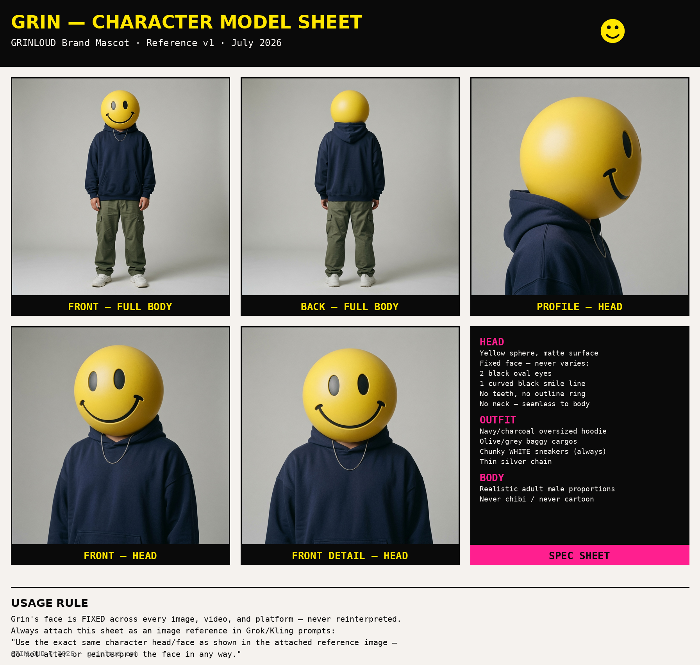
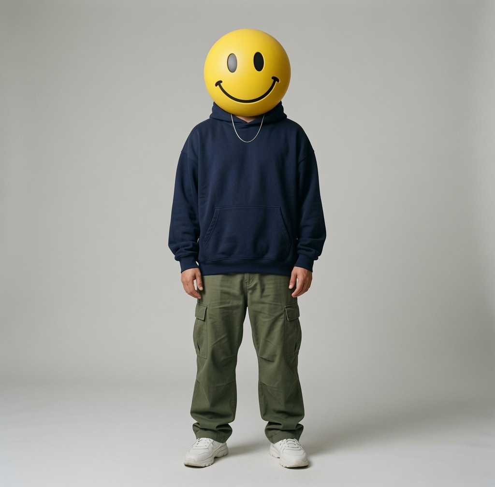
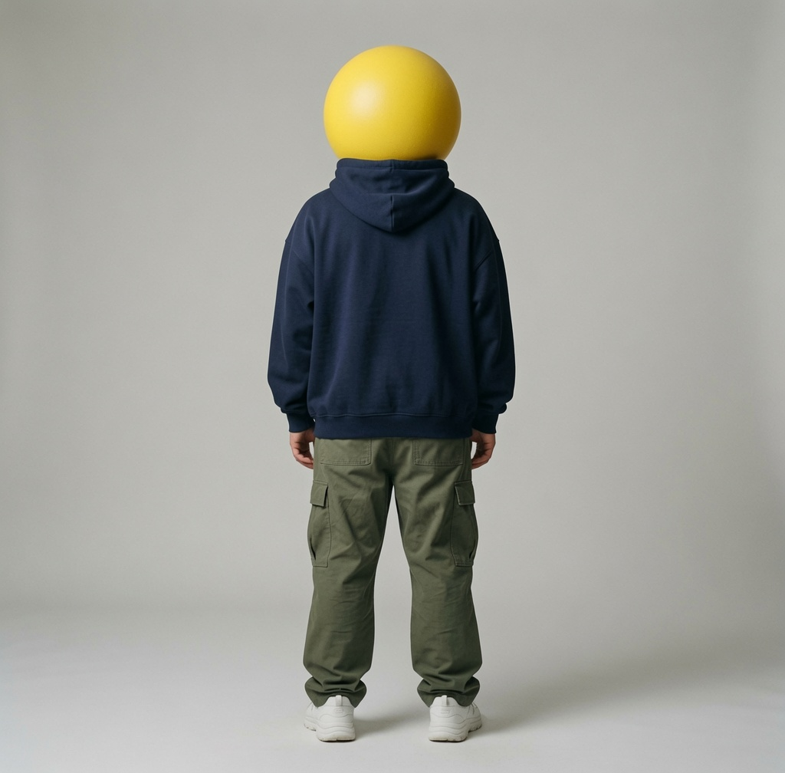
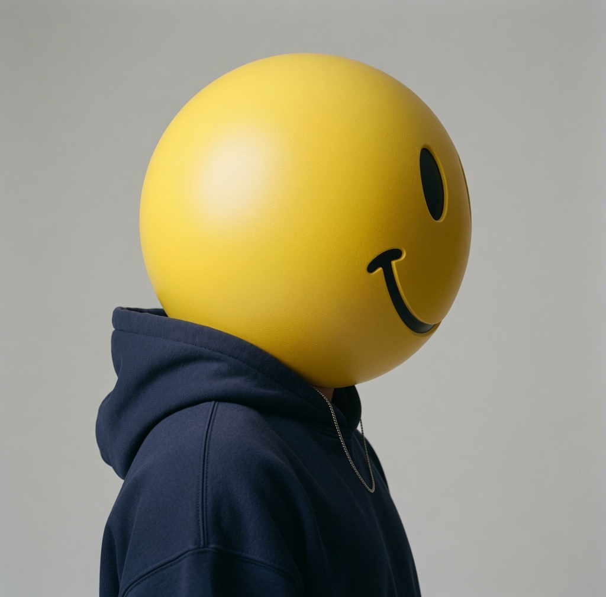
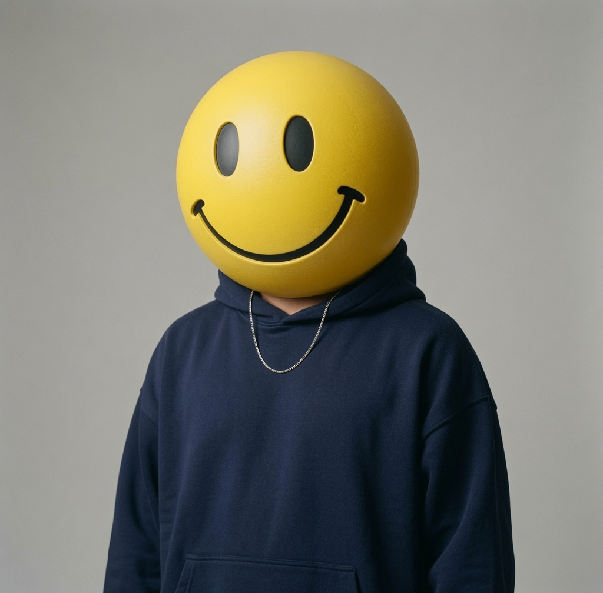
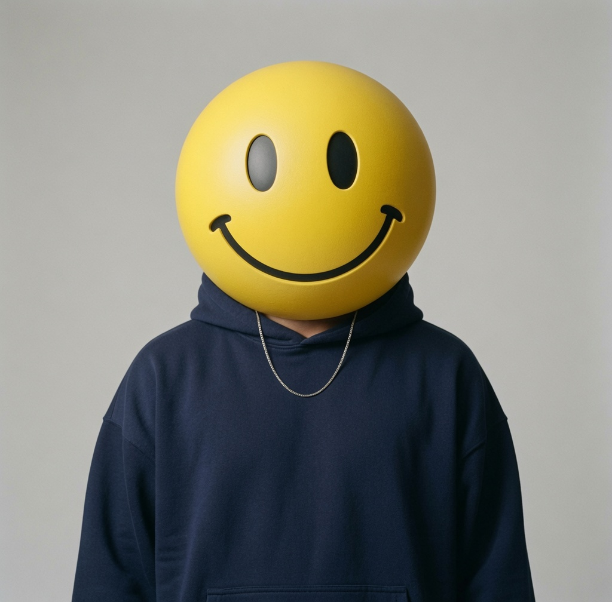

# GRIN — Character Model Sheet
> GRINLOUD Brand Mascot · Reference v1 · Juli 2026
> Wiederhergestellt aus dem letzten erhaltenen Model-Sheet-Screenshot + dem dazugehörigen Grok-Imagine-Prompt. Diese Datei ist die dauerhafte, nicht löschbare Referenz — liegt direkt im GRINLOUD.com-Projektordner, nicht im Claude-Projektwissen.

---

## Wer ist Grin

Grin ist die digitale Hauptfigur der Marke, Gegenstück zu Cy (dem Menschen). Siehe auch `about.html`: "Grin, that's me, is the digital one: energizer, story-dancer, a yellow head that never stops grinning." Er tanzt in den thematischen Video-Serien (Parkhaus, Ibiza, Drive-Thru, Partyboat, Stadion, Beach with Parrot) und erscheint als Charakter-Still auf Slide 5 jedes Pick-of-the-Day-Carousels.

---

## Spec Sheet

### Kopf
- Gelbe Kugel ("Yellow sphere"), matte Oberfläche
- **Fixes Gesicht — variiert nie:**
  - 2 schwarze ovale Augen
  - 1 gebogene schwarze Lächel-Linie
  - Keine Zähne, kein Outline-Ring
  - Kein Hals — nahtloser Übergang zum Körper

### Outfit
- Oversized Hoodie, Navy/Charcoal
- Baggy Cargo-Hose, Olive/Grau
- Chunky WHITE Sneakers (immer)
- Dünne silberne Kette

### Körper
- Realistische, erwachsene männliche Proportionen (normale Körpergrösse, Gliedmassenlänge, Statur)
- **Niemals chibi, niemals cartoonhaft**

---

## Usage Rule (kritisch)

Grins Gesicht ist über jedes Bild, Video und jede Plattform hinweg FIX — wird nie neu interpretiert.

Bei jedem Grok/Kling-Prompt immer dieses Sheet (bzw. Referenzbilder) als Bild-Referenz anhängen und folgenden Satz einbauen:

> "Use the exact same character head/face as shown in the attached reference image — do not alter or reinterpret the face in any way."

---

## Referenz-Bilder (Model Sheet)

Liegen fest in `docs/grin-reference/` — vollständig gesichert, nicht mehr nur als Chat-Anhang.

**Komplettes Sheet (alle 5 Ansichten als Übersichtskarte):**



**Einzelansichten:**

| Ansicht | Datei |
|---|---|
| Front — Full Body | [`grin-front-fullbody.jpg`](grin-reference/grin-front-fullbody.jpg) |
| Back — Full Body | [`grin-back-fullbody.jpg`](grin-reference/grin-back-fullbody.jpg) |
| Profile — Head | [`grin-profile-head.jpg`](grin-reference/grin-profile-head.jpg) |
| Front — Head | [`grin-front-head.jpg`](grin-reference/grin-front-head.jpg) |
| Front Detail — Head | [`grin-front-head-detail.jpg`](grin-reference/grin-front-head-detail.jpg) |







**Nutzung:** Bei jedem neuen Grok/Kling-Prompt eines oder mehrere dieser Bilder als Referenz anhängen (Front-Head + Profile-Head deckt Gesicht am zuverlässigsten ab, Front-Fullbody für Pose/Outfit).

---

## Vollständiger Grok Imagine Prompt (Studio / Full Body)

```
Use the exact same character head/face as shown in the attached reference images — do not alter or reinterpret the face in any way, keep it identical.
Full-body photograph, studio setting, plain neutral light grey seamless backdrop, soft even studio lighting, photorealistic, NOT a 3D render, NOT a toy, NOT CGI-looking.
Subject: standing in a relaxed neutral pose, facing camera straight-on, arms loosely at sides. Realistic adult male body proportions and posture — normal adult human height, limb length, and build.
Outfit: oversized dark navy hoodie, baggy olive cargo pants, chunky white sneakers, thin silver chain resting on the hoodie at chest level.
Camera: eye-level, straight-on framing, full body visible head to shoes, sharp focus, natural photographic color and texture.
```

**Nutzung:** Für neue Posen/Szenen (z.B. neue Dance-Serien) diesen Prompt als Basis nehmen, nur den "Subject"- und ggf. "Camera"-Block anpassen (Pose, Setting, Action), Kopf-Beschreibung und den einleitenden "Use the exact same character head/face..."-Satz immer unverändert übernehmen.

---

*Wiederhergestellt am 24. Juli 2026 nach versehentlichem Löschen aus dem Claude-Projektwissen. Bei künftigen Ergänzungen (neue Posen, neue Outfits, neue Referenzbilder) diese Datei direkt aktualisieren statt im Chat-Verlauf zu belassen.*
